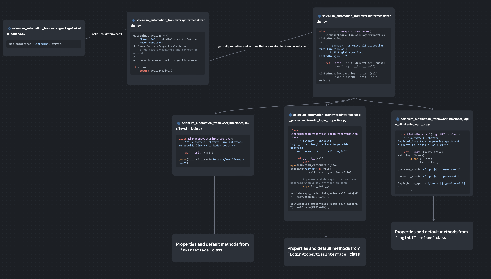
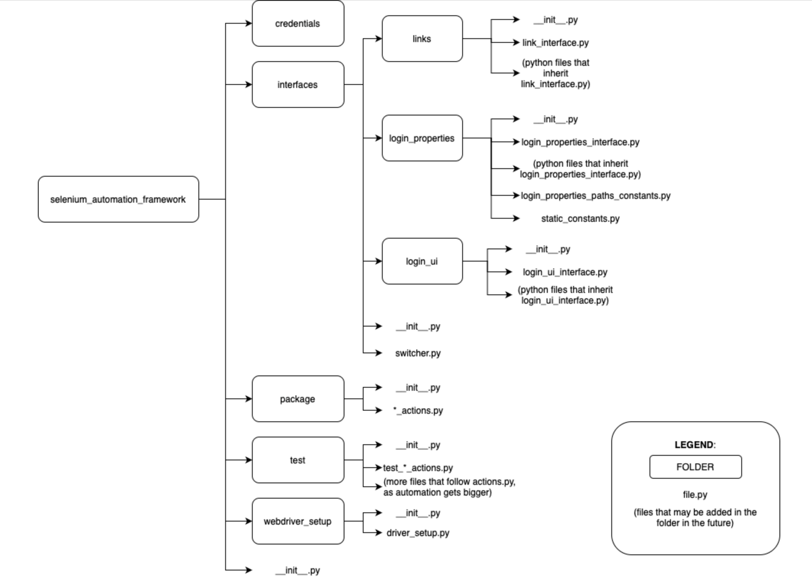

# Selenium Automation Framework

## Introduction

The Selenium Automation Framework, a powerful and highly flexible tool, robustly performs a variety of actions. These actions include the automation of sign in and sign out procedures, the interaction with web elements, and the return of search results. These functions are integral in streamlining the process of interacting with web elements, thus reducing the manual effort required. It's worth noting that this framework can function independently, as long as you have chromedriver installed; it doesn't require additional software or frameworks to operate. Moreover, its adaptability makes it a valuable tool for a wide range of projects. The Selenium Automation Framework can be easily copied and integrated into other projects without compromising its functionality or missing any methods that might be necessary from other frameworks. In essence, it's a standalone solution that can cater to a wide variety of automation needs.

## How The Code Works



1. Actions on how to interact with the website that you’re looking for can be found inside the python file that has `actions.py` suffix inside the package folder. It calls the `use_determiner()` method from `interfaces/switcher.py`. The package folder is the only package you need, if you want to utilise the automation framework to interact with other commands from other frameworks.
2. The `use_determiner()` method from `interfaces/switcher.py` accepts a string parameter. This parameter determines which class, along with its properties and methods, will be invoked. A new instance of the specified class is then created.
3. The returned class instance inherits classes from `links`, `login_properties`, and `login_ui` located in the `interfaces` folder. This folder contains Python interface files that provide generic interface properties and methods. These interface files are inherited by different website classes. The properties and methods of these website classes are then inherited by the class instance specified in point 2.
4. The different website classes return an instance of different properties on how to interact to the website, to the class inheritance assigned in `interfaces/switcher.py` `use_determiner()` method. 
5. `use_determiner()` method returns an instance of the assigned class, together with the instance, properties, and methods of the inherited classes, and you can interact by assigned new variables to existing properties or utilising the existing values of the properties.

## Folder Structure



### Main Components of the Automation Framework:

1. **`credentials` Folder** - holds the different encrypted username and password, in JSON file, seperated for every website.
2. **`interfaces` Folder** - handles the different properties of every website, such as accessing to links, retrieving of username and password, interacting with web elements, etc.
3. **`package` folder** - handles the actions on how to interact with the website using selenium. You can also retrieve the different properties inherited from class instances of the assigned website class file.
4. **`test` folder** - handles the test side of the framework, as it makes sure that the framework is supposed to work as it’s expected to do. 
5. **`webdriver_setup` folder** - has a file called `driver_setup.py` file that returns an instance of a `webdriver.Chrome()` class, which is assigned to action files inside the package folder. The `webdriver.Chrome()` instance class handles the orchestration and serves as the driver of the web automation.

### Interfaces Folder

The Interfaces folder composes of different generic properties and methods that you can do in a website. You can add more properties and methods that are specific to your website of choice, if you add more.

Inside every folders under the `interfaces` folder has an interface python file, which provides the generic properties and methods per folder. Then inside the folders are the inherited class from the interface python files, as a separate python file. From there you can add more properties aside from the ones from the interface files.

1. **`links` folder** - provides the properties and methods about what part of the website will be accessed.
2. **`login_properties` folder** - provides properties and methods about the username and password that are needed to be able to log in to the website.
3. **`login_ui` folder** - provides properties and methods that pertains to the login page of every website.
4. **`switcher.py`** - a python file where `use_determiner()` is located and where other switcher python classes can be found as well.

### `login_properties` Folder

Aside from the interface file and inherited python files from the interface file, there are two notable files that are also important:

1. **`login_properties_paths_constants.py`** - constants python file where you will assign properties path to the JSON credentials files for login and password. The default path to get the credentials is from the `credentials` folder.
2. **`static_constants.py`** - constants python file where you assign the JSON properties of credentials from the `credentials` folder.

## Framework Best Practices

1. You can add a folder that sets generic properties and methods for a component of a website. However, every time a new folder is made, there **must** be an interface file, where generic methods and properties for a specific component of the website are found. Then this must be inherited by the website class.
2. The naming convention of the python interface file must be `<folder_name>_interface.py` where `<folder_name>` is the name of the additional folder indicated in point 1.
3. You can provide constants python files inside the folder in interfaces. See `login_properties` folder to see example of multiple constants files and their usage.
4. All folders inside interfaces file must also have `__init__.py` files for relative imports purposes in python.
5. All new methods should be created within existing Python files and folders, following the definitions provided in the Folder Structure section of this documentation. If a method doesn't fit within any existing Python files or folders, a new folder should be created, adhering to best practices numbers 1-4. This approach ensures the code remains reusable, scalable, and easy to decouple.
6. All additional python codes should adhere to best practices followed by default Pylint documentation.
7. `paths_constants.py` and `static_constants.py` inside the `interfaces/login_properties` folder should adhere to the actual purpose of the files. Refer to “ login_properties folder” section of this page to know the purpose of these files.

## Testing

Having a dedicated testing file for the Selenium Automation Framework is essential to ensure that the code runs as expected during automation. We can use the testing file to activate it using the command line and eventually incorporate it into CI/CD pipelines before merging to production. The testing framework utilises `pytest` to implement test coverage within the framework.

**Steps to run the test file**:

1. Open a command line interface to activate terminal. In this case, the terminal from Visual Studio Code is opened.
2. Type `coverage run -m pytest` to start testing the Framework. The result should be something like this:

```bash
justinevillarosa@Justines-MacBook-Air job_application_automation % coverage run -m pytest
======================================================================= test session starts ========================================================================
platform darwin -- Python 3.12.1, pytest-8.0.0, pluggy-1.4.0
rootdir: /Users/justinevillarosa/Documents/Projects/job_application_automation
plugins: cov-4.1.0
collected 5 items                                                                                                                                                  

excel_framework/test/test_excel_framework.py ...                                                                                                             [ 60%]
selenium_automation_framework/test/test_linkedin_actions.py ..                                                                                               [100%]

========================================================================= warnings summary =========================================================================
excel_framework/test/test_excel_framework.py: 17 warnings
  /Library/Frameworks/Python.framework/Versions/3.12/lib/python3.12/site-packages/openpyxl/packaging/core.py:99: DeprecationWarning: datetime.datetime.utcnow() is deprecated and scheduled for removal in a future version. Use timezone-aware objects to represent datetimes in UTC: datetime.datetime.now(datetime.UTC).
    now = datetime.datetime.utcnow()

excel_framework/test/test_excel_framework.py::test_add_data_without_filename
excel_framework/test/test_excel_framework.py::test_add_data_with_existing_filename
excel_framework/test/test_excel_framework.py::test_add_data_to_empty_row_cell
  /Library/Frameworks/Python.framework/Versions/3.12/lib/python3.12/site-packages/openpyxl/writer/excel.py:292: DeprecationWarning: datetime.datetime.utcnow() is deprecated and scheduled for removal in a future version. Use timezone-aware objects to represent datetimes in UTC: datetime.datetime.now(datetime.UTC).
    workbook.properties.modified = datetime.datetime.utcnow()

-- Docs: https://docs.pytest.org/en/stable/how-to/capture-warnings.html
================================================================== 5 passed, 20 warnings in 7.27s ==================================================================
```

3. Type `coverage report -m` to see the code coverage of your Framework. It will also show which lines are not yet scoped in the test coverage after running test.

```bash
justinevillarosa@Justines-MacBook-Air job_application_automation % coverage report -m    
Name                                                                                            Stmts   Miss  Cover   Missing
-----------------------------------------------------------------------------------------------------------------------------
__init__.py                                                                                         0      0   100%
excel_framework/__init__.py                                                                         0      0   100%
excel_framework/package/__init__.py                                                                 0      0   100%
excel_framework/package/excel_framework.py                                                         23      1    96%   59
excel_framework/test/__init__.py                                                                    0      0   100%
excel_framework/test/static_constants.py                                                           15      0   100%
excel_framework/test/test_excel_framework.py                                                       24      0   100%
excel_framework/test/test_helpers.py                                                               35      2    94%   36, 58
selenium_automation_framework/__init__.py                                                           0      0   100%
selenium_automation_framework/interfaces/__init__.py                                                0      0   100%
selenium_automation_framework/interfaces/links/__init__.py                                          0      0   100%
selenium_automation_framework/interfaces/links/link_interface.py                                   11      2    82%   13, 17
selenium_automation_framework/interfaces/links/linkedin_login.py                                    4      0   100%
selenium_automation_framework/interfaces/login_UI/__init__.py                                       0      0   100%
selenium_automation_framework/interfaces/login_UI/linkedin_login_ui.py                              5      0   100%
selenium_automation_framework/interfaces/login_UI/login_ui_interface.py                            39      0   100%
selenium_automation_framework/interfaces/login_properties/__init__.py                               0      0   100%
selenium_automation_framework/interfaces/login_properties/linkedin_login_properties.py              9      0   100%
selenium_automation_framework/interfaces/login_properties/login_properties_interface.py            30      4    87%   26, 40, 45, 55
selenium_automation_framework/interfaces/login_properties/login_properties_paths_constants.py       1      0   100%
selenium_automation_framework/interfaces/login_properties/static_constants.py                       3      0   100%
selenium_automation_framework/interfaces/switcher.py                                               16      1    94%   33
selenium_automation_framework/package/__init__.py                                                   0      0   100%
selenium_automation_framework/package/linkedin_actions.py                                          11      0   100%
selenium_automation_framework/test/__init__.py                                                      0      0   100%
selenium_automation_framework/test/test_linkedin_actions.py                                        21      0   100%
selenium_automation_framework/webdriver_setup/__init__.py                                           0      0   100%
selenium_automation_framework/webdriver_setup/driver_setup.py                                      19      3    84%   26-28
-----------------------------------------------------------------------------------------------------------------------------
TOTAL                                                                                             266     13    95%
justinevillarosa@Justines-MacBook-Air job_application_automation % 
```

## Testing Best Practices

- Test coverage for the entire framework should be 80% minimum per file and overall coverage. If you added files within the framework, it is required to add the method added to the testing file (or make a separate testing file, if it is a new file inside the framework) to increase the test coverage.
- The testing file should have a prefix `test_` so that pytest can pick it up and recognise it is a python test file.
- Inside of that test file should not be enclosed in a class. Methods should also have a prefix `test_`  so that pytest can also pick it up as a test method. (e.g. method name should be `test_return_numbers()` )
- Always use `assert` for every method, as this will be the overall evaluation that the code works.
- Use `test_helpers.py` to place all reusable methods being used by the test file itself, to prevent spaghetti code.